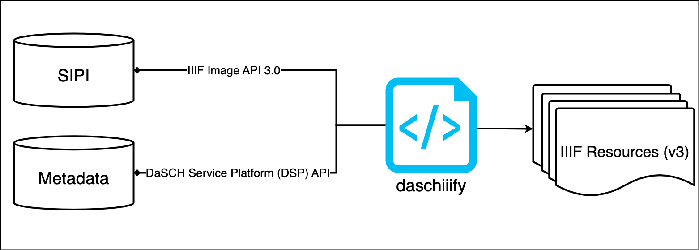

# daschiiify
The purpose of this repository is to develop a script that can generate [IIIF Presentation API 3.0](https://iiif.io/api/presentation/3.0/) resources for DaSCH leveraging the [iiif-prezi3 library](https://iiif-prezi.github.io/iiif-prezi3/). 

The idea is to use the DaSCH Service Platform (DSP) API and the IIIF Image API 3.0 — through our Simple Image Presentation Interface (SIPI) instance — for populating the IIIF resources (`Manifest` and `Collection`) and to upgrade the [experimental and outdated IIIF Manifests feature](https://docs.dasch.swiss/2023.02.02/DSP-API/03-endpoints/api-v2/reading-and-searching-resources/#iiif-manifests).

At the moment, an [alpha script](/test/daschiiify-alpha.py) is in development to generate a particular IIIF resource, still waiting on how to leverage the DSP API in an efficient manner. 

## Requirements
- [ ] Populating the Presentation API resources through DSP API requests, possibly without using Gravsearch
- [ ] IIIF Manifests and Collections should have their own subdomain (e.g. `https://daschiiify.dasch.swiss/`) and they should not be stored where the DSP API lives
- [ ] The DaSCH logo should ideally be served through our SIPI instance

## Open questions
- What kind of assumptions should be done when we don't have the metadata (e.g. assuming `left-to-right` structural sequence for multi-page Manifests or rights metadata)?
- Which descriptive metadata should be appended to the `metadata` property in our IIIF resources (all of them, a selection)?
- How should the `daschiiify` script be leveraged within the DaSCH infrastructure once it's stable?

## Templates
The templates or boilerplates have been documented and stored on this [dedicated repository](https://github.com/dasch-swiss/iiif-templates). 